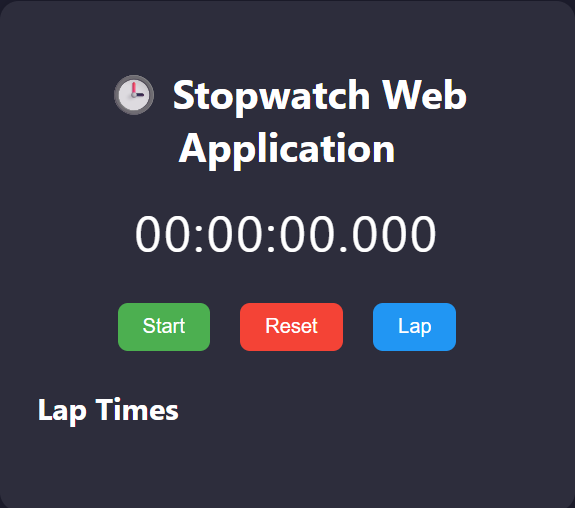

# ⏱ Stopwatch Web Application

A simple, interactive, and user-friendly stopwatch built using **HTML**, **CSS**, and **JavaScript**.  
This app lets you start, pause, reset the timer, and record lap times for accurate time tracking.

## 📌 Features

- **Start/Pause** functionality for precise control.
- **Reset** to clear all timings instantly.
- **Lap recording** to store multiple time intervals.
- Millisecond-level accuracy.
- Scrollable lap list for long sessions.
- Clean, modern, and responsive design.

## 📷 Screenshot



## 🛠 Technologies Used
- **HTML5** – structure of the application.
- **CSS3** – styling and layout design.
- **JavaScript (ES6)** – stopwatch logic and interactivity.


## 🚀 How to Run the Project

1. **Clone the Repository**
   ```bash
   git clone https://github.com/Tharunpatnayak/SCT_WD_2.git

2. Navigate to the Project Folder
  cd stopwatch-web-app

3. Open in Browser
Open index.html in your preferred browser.

📂 Project Structure
bash
Copy
Edit
stopwatch-web-app/
│
├── index.html   # Main HTML file
├── style.css    # Styling
├── script.js    # Stopwatch functionality
└── screenshot.png # Preview image (optional)

🖱 Usage Instructions
Click Start to begin timing.

Click Pause to halt the timer.

Click Lap to save the current time to the lap list.

Click Reset to clear the timer and lap records.
